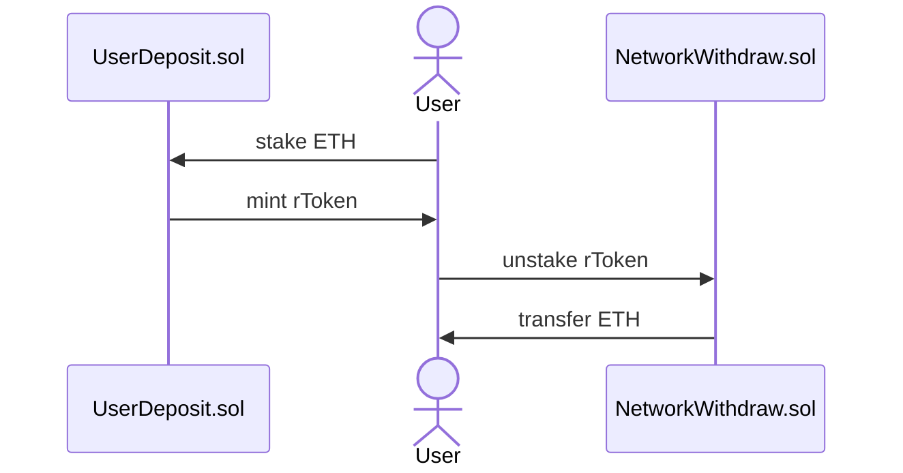
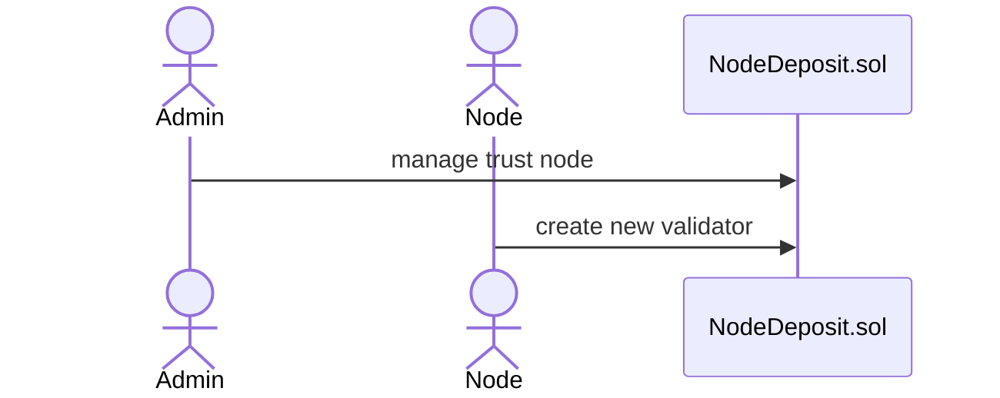
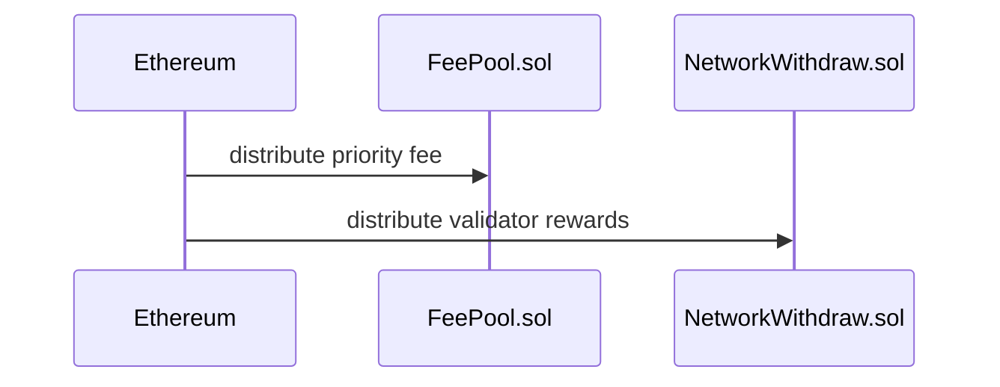
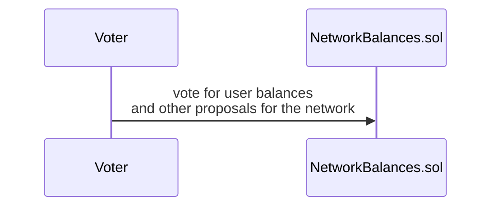

# eth-lsd-contracts

Contracts is the foundation of ETH LSD stack. It consists of LsdToken, UserDeposit, NodeDeposit and NetworkWithdraw and other contracts, which enables users to stake, unstake and withdraw, validators to run node with minimum amount of ETH and platform to manage solo and trust nodes. 

To learn more about ETH LSD stack, see [**ETH LSD Stack Documentation and Guide**](https://github.com/stafiprotocol/stack-docs/blob/main/README.md#eth-lsd-stack)

a very brief diagrams of the workflow:

